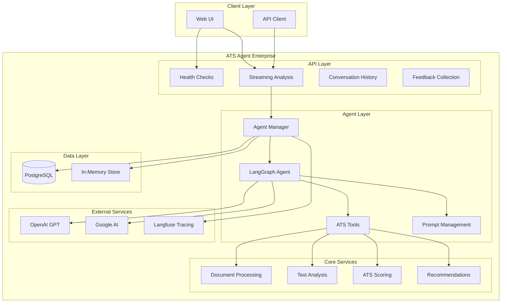

# 🚀 ATS Resume Reviewer Agent

[](https://www.python.org/downloads/)
[](https://fastapi.tiangolo.com/)
[](https://langchain.com/)

A production-ready ATS (Applicant Tracking System) resume reviewer agent built with LangChain, LangGraph, and FastAPI. Provides advanced resume analysis, optimization recommendations, and real-time streaming capabilities.

## 🌟 Features

### 🎯 Core Functionality
- **Advanced ATS Analysis**: Comprehensive keyword matching, skills gap analysis, and compatibility scoring
- **Real-time Streaming**: Server-Sent Events (SSE) for live analysis feedback with token-level streaming
- **Multi-format Support**: Process PDF, DOCX, and plain text resumes
- **Intelligent Recommendations**: AI-powered suggestions for resume optimization

### 🏢 Enterprise Features  
- **Conversation Management**: Multi-turn conversations with thread persistence
- **PostgreSQL Integration**: Scalable database storage for conversation history
- **Observability**: Langfuse integration for tracing and performance monitoring
- **Health Monitoring**: Comprehensive health checks and readiness probes
- **Feedback System**: Built-in feedback collection and analysis
- **Production Ready**: SSL support, CORS configuration, error handling

### 🤖 AI & Agent Architecture
- **LangChain + LangGraph**: Advanced agent orchestration with stateful conversations
- **Multiple LLM Support**: OpenAI GPT and Google Generative AI integration  
- **Custom Tools**: Specialized document processing, analysis, and scoring tools
- **Streaming Support**: Real-time token streaming with SSE

## 🏗️ Architecture



## Quick start

Authoritative **install, environment, and run** steps (including `LLM_PROVIDER`, `/v1/report`, and when you need Postgres) live in the **repository root** [README.md](../README.md).

From the **parent** directory you can use the same **`make install`** / **`make local`** flow as [template-agent](https://github.com/redhat-data-and-ai/template-agent) (venv at repo root, server started with cwd set to this folder for `.env`).

From **this** directory after `pip install -e .`:

```bash
cp .env.example .env   # then edit keys / model names
ats-agent              # or: python -m ats_agent.src.main
curl http://localhost:8082/health
```

## API usage

See the root [README.md](../README.md) for **`POST /v1/report`** (one JSON report), **`resume_url` / `job_description_url`**, and optional job text.

### Streaming analysis (SSE)

```bash
curl -X POST "http://localhost:8082/v1/stream" \
  -H "Content-Type: application/json" \
  -H "Accept: text/event-stream" \
  -d '{
    "message": "Analyze my resume",
    "resume_text": "John Smith\nSoftware Engineer\n...",
    "job_description": "We are seeking a Senior Software Engineer...",
    "stream_tokens": true
  }'
```

### Synchronous analysis

```bash
curl -X POST "http://localhost:8082/v1/analyze" \
  -H "Content-Type: application/json" \
  -d '{
    "resume_text": "Your resume content here...",
    "job_description": "Job requirements here...",
    "analysis_type": "full_analysis"
  }'
```

### Response Format

Streaming responses use Server-Sent Events:

```
data: {"type": "token", "content": "Your"}
data: {"type": "token", "content": " resume"}
data: {"type": "message", "content": {"type": "ai", "content": "Analysis complete..."}}
data: [DONE]
```

## 📊 Analysis Output

The agent provides comprehensive analysis in 9 structured sections:

### 🎯 1. ATS Match Score (0-100)
- Overall compatibility score with detailed breakdown
- Letter grade (A+ to F) and percentile ranking
- Score explanation and improvement potential

### 🔍 2. Keyword Analysis  
- **✅ Matched Keywords**: Terms found in both resume and job description
- **❌ Missing Keywords**: Critical terms absent from resume
- **📊 Match Statistics**: Detailed keyword metrics and density analysis

### 🎯 3. Skills Gap Analysis
- **Present Skills**: Technical and soft skills identified in resume
- **Missing Critical Skills**: Required skills not found in resume  
- **Skill Categories**: Organized by technical, programming, frameworks, soft skills
- **Learning Recommendations**: Suggested skills to acquire

### 💪 4. Resume Strengths
- Quantified achievements and strong action verbs
- Well-structured content and relevant experience
- Industry-appropriate terminology usage

### ⚠️ 5. Areas for Improvement
- Weak language patterns and missing quantification
- ATS compatibility issues and format problems
- Content gaps and relevance concerns

### 🚀 6. Priority Recommendations
- **High Priority**: Critical changes with immediate impact
- **Medium Priority**: Significant improvements for better results  
- **Low Priority**: Polish and optimization suggestions

### ✨ 7. Content Optimization Examples
- Before/after examples of improved bullet points
- Action verb enhancement suggestions
- Quantification opportunities

### 📝 8. Tailored Professional Summary
- Job-specific professional summary rewrite
- Key requirements integration
- Value proposition highlighting

### 🎯 9. Final Action Plan
- Step-by-step improvement roadmap
- Implementation priorities and timelines
- Expected impact of each change

## ⚙️ Configuration

### Environment Variables

```bash
# Server Configuration
AGENT_HOST=0.0.0.0
AGENT_PORT=8082
AGENT_ENV=development

# Database
POSTGRES_USER=ats_user
POSTGRES_PASSWORD=ats_password
POSTGRES_DB=ats_agent
POSTGRES_HOST=localhost
POSTGRES_PORT=5432

# AI Models (provide at least one)
OPENAI_API_KEY=your_openai_key
GOOGLE_API_KEY=your_google_key

# Langfuse (optional)
LANGFUSE_PUBLIC_KEY=your_langfuse_public_key
LANGFUSE_SECRET_KEY=your_langfuse_secret_key
LANGFUSE_BASE_URL=https://cloud.langfuse.com
```

### Storage Options

- **In-Memory**: Set `USE_INMEMORY_SAVER=true` for development
- **PostgreSQL**: Set `USE_INMEMORY_SAVER=false` for production persistence

## 🧪 Development

### Project Structure

```
ats_agent/
├── src/
│   ├── core/                   # Core agent functionality
│   │   ├── agent.py           # LangGraph agent setup
│   │   ├── manager.py         # Agent orchestration
│   │   ├── prompt.py          # System prompts
│   │   └── tools.py           # Custom LangChain tools
│   ├── routes/                # FastAPI endpoints
│   │   ├── health.py          # Health checks
│   │   ├── stream.py          # Streaming analysis
│   │   ├── history.py         # Conversation management
│   │   └── feedback.py        # Feedback collection
│   ├── utils/                 # Utilities
│   │   └── logger.py          # Logging configuration
│   ├── api.py                 # FastAPI application
│   ├── main.py                # Service entry point
│   ├── schema.py              # Pydantic models
│   └── settings.py            # Configuration management
├── tests/                     # Test suite
└── README.md                  # This file
```

### Running Tests

```bash
pytest                         # Run all tests
pytest --cov                  # Run with coverage
pytest -v tests/test_agent.py # Run specific tests
```

### Code Quality

```bash
black .                        # Format code
isort .                        # Sort imports  
ruff check .                   # Lint code
mypy ats_agent/     # Type checking
```

## 🚀 Deployment

### Docker

```dockerfile
FROM python:3.10-slim

WORKDIR /app
COPY . .
RUN pip install -e .

EXPOSE 8082
CMD ["ats-agent"]
```

### Production Considerations

- **SSL/TLS**: Configure certificates for HTTPS
- **Database**: Use managed PostgreSQL service  
- **Monitoring**: Set up Langfuse for observability
- **Scaling**: Use load balancers and horizontal scaling
- **Security**: Implement authentication and rate limiting

## 📈 Monitoring & Observability

### Health Checks

- `GET /health` - Service health status
- `GET /health/ready` - Readiness for traffic
- `GET /health/live` - Basic liveness check

### Metrics & Tracing

- **Langfuse Integration**: Automatic request tracing and performance monitoring
- **Custom Metrics**: Response times, success rates, error tracking
- **Feedback Analytics**: User satisfaction and improvement trends

## 🔒 Security Features

- **Input Validation**: Comprehensive request validation with Pydantic
- **Error Handling**: Secure error responses without information leakage
- **CORS Configuration**: Configurable cross-origin resource sharing
- **Rate Limiting**: Built-in request rate limiting capabilities
- **SSL Support**: Production-ready HTTPS configuration

## 🤝 Contributing

1. Fork the repository
2. Create a feature branch (`git checkout -b feature/amazing-feature`)
3. Make your changes and add tests
4. Ensure all tests pass (`pytest`)
5. Run code quality checks (`ruff`, `black`, `mypy`)
6. Submit a pull request

## 📄 License

This project is licensed under the Apache 2.0 License - see the [LICENSE](LICENSE) file for details.

## 🆘 Support

- **Issues**: [GitHub Issues](https://github.com/your-org/ats-agent/issues)
- **Documentation**: [Full Documentation](https://docs.your-org.com/ats-agent)
- **Email**: support@your-org.com

## 🔗 Related Projects

- [Original ATS Agent](../ats_agent.py) - Simple command-line version
- [LangChain](https://github.com/langchain-ai/langchain) - LLM application framework
- [LangGraph](https://github.com/langchain-ai/langgraph) - Stateful agent framework
- [FastAPI](https://fastapi.tiangolo.com/) - Modern web framework
- [Langfuse](https://langfuse.com/) - LLM observability platform

---

**Built with ❤️ using modern AI and enterprise-grade architecture**